# Entregable 3 — Diagramas UML

**Proyecto:** Accesorios D&M — Sistema E-Commerce  
**Versión:** 1.0  
**Fecha:** 2026-05-18  
**Herramienta de notación:** PlantUML / Mermaid

---

## 1. Diagramas de Casos de Uso

### CU-01: Registro e Inicio de Sesión (Autenticación)

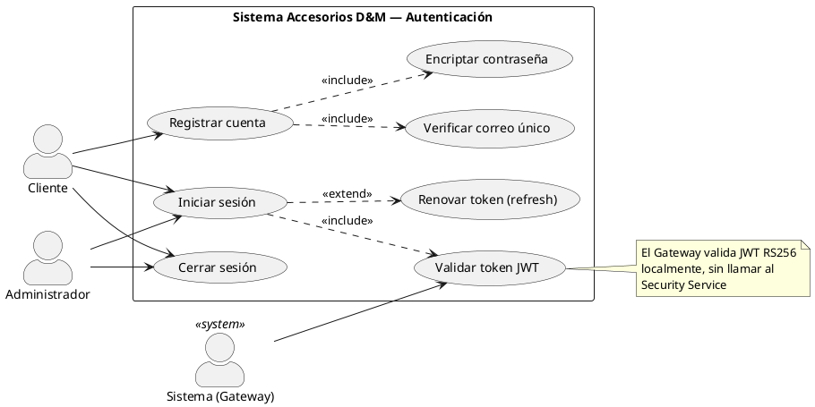

**Actores:**

- **Cliente:** Usuario registrado que desea acceder al sistema.
- **Administrador:** Empleado de la tienda con permisos elevados.
- **Sistema (Gateway):** Actor secundario que valida tokens automáticamente en cada request.

**Casos de uso:**

| ID  | Nombre                 | Descripción                                                       |
| --- | ---------------------- | ----------------------------------------------------------------- |
| UC1 | Registrar cuenta       | El cliente crea una cuenta con correo, contraseña y nombre        |
| UC2 | Iniciar sesión         | El usuario se autentica y recibe un token JWT RS256               |
| UC3 | Validar token JWT      | El Gateway verifica firma, expiración e issuer del token          |
| UC4 | Renovar token          | Extensión: si el token está próximo a expirar, se emite uno nuevo |
| UC5 | Cerrar sesión          | El token se invalida en cliente; opcionalmente en blacklist       |
| UC6 | Verificar correo único | Include de UC1: comprueba que el correo no esté registrado        |
| UC7 | Encriptar contraseña   | Include de UC1: aplica bcrypt antes de persistir                  |

---

### CU-02: Gestión del Catálogo de Productos (Admin)

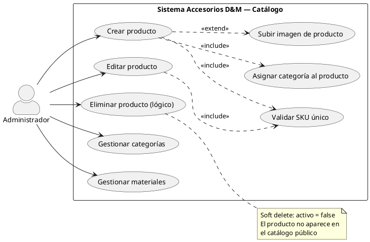

**Actores:**

- **Administrador:** Único actor autorizado para modificar el catálogo.

**Flujo principal (Crear producto):**

1. Admin accede al panel de administración.
2. Completa formulario: SKU, nombre, descripción, precio, categoría, material.
3. El sistema valida que el SKU no existe.
4. El sistema guarda el producto con `activo = true`.
5. Opcionalmente, el admin sube imágenes del producto.

---

### CU-03: Consulta del Catálogo (Cliente)

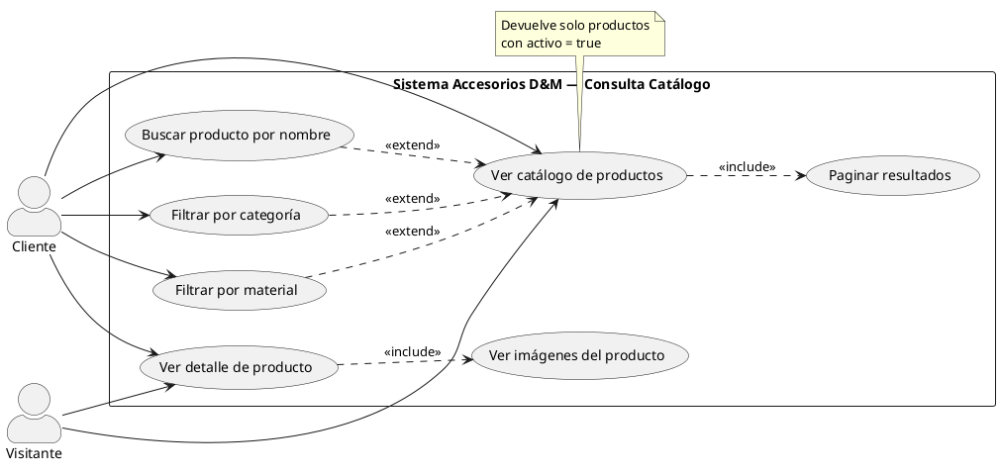

**Actores:**

- **Cliente:** Usuario autenticado que navega el catálogo.
- **Visitante:** Usuario no autenticado (si se habilita el acceso público al catálogo).

---

### CU-04: Gestión del Carrito de Compras

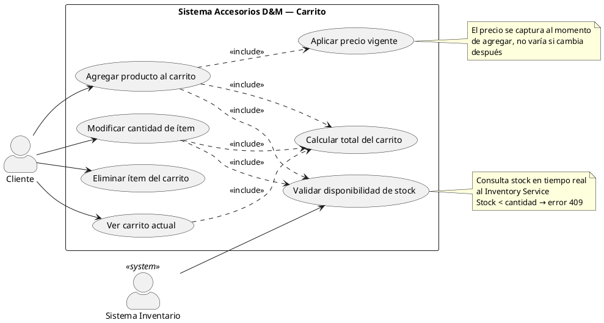

**Actores:**

- **Cliente:** Gestiona su carrito de compras activo.
- **Sistema Inventario:** Valida disponibilidad de stock en tiempo real.

---

### CU-05: Proceso de Compra y Gestión de Órdenes

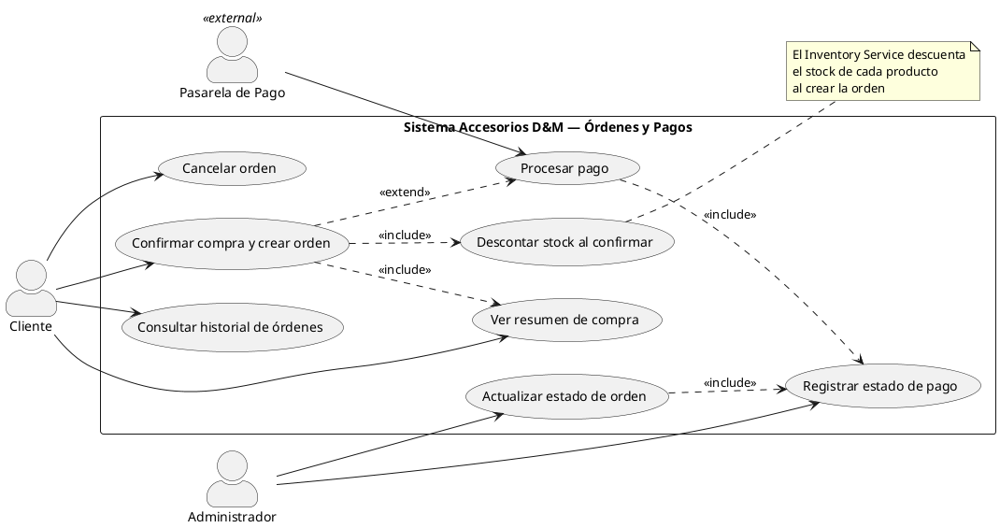

**Actores:**

- **Cliente:** Confirma la compra y puede consultar sus órdenes.
- **Administrador:** Gestiona el ciclo de vida de las órdenes.
- **Pasarela de Pago:** Actor externo que procesa el pago (MVP: sandbox).

---

### CU-06: Gestión de Inventario (Admin)

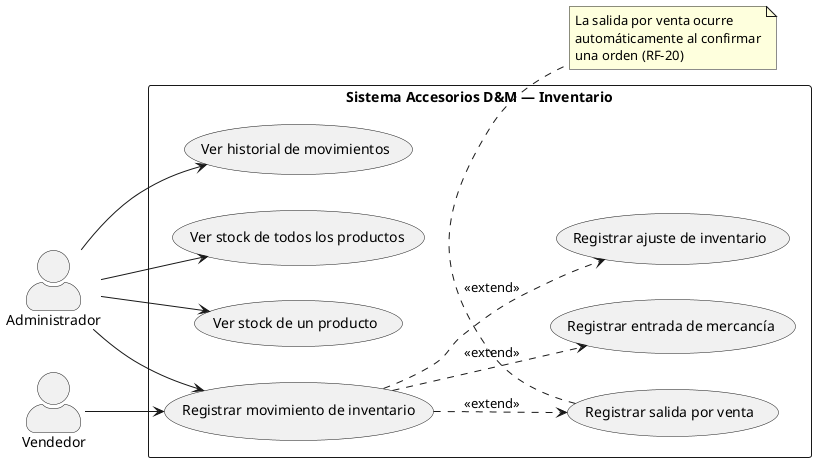

---

## 2. Diagrama de Clases

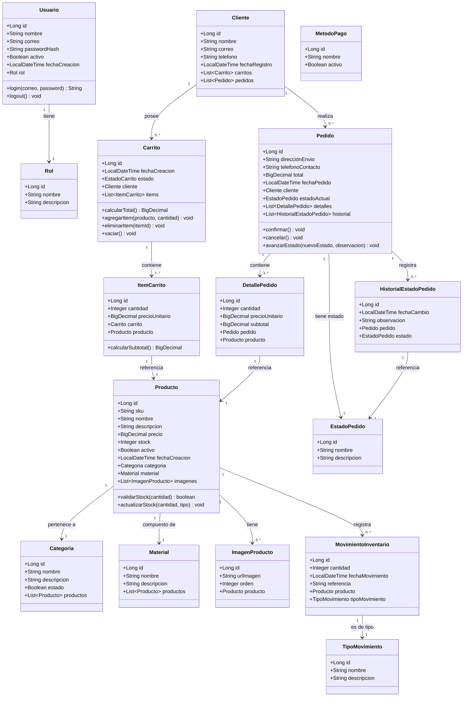

---

## 3. Diagramas de Secuencia

### DS-01: Flujo de Inicio de Sesión y Validación JWT

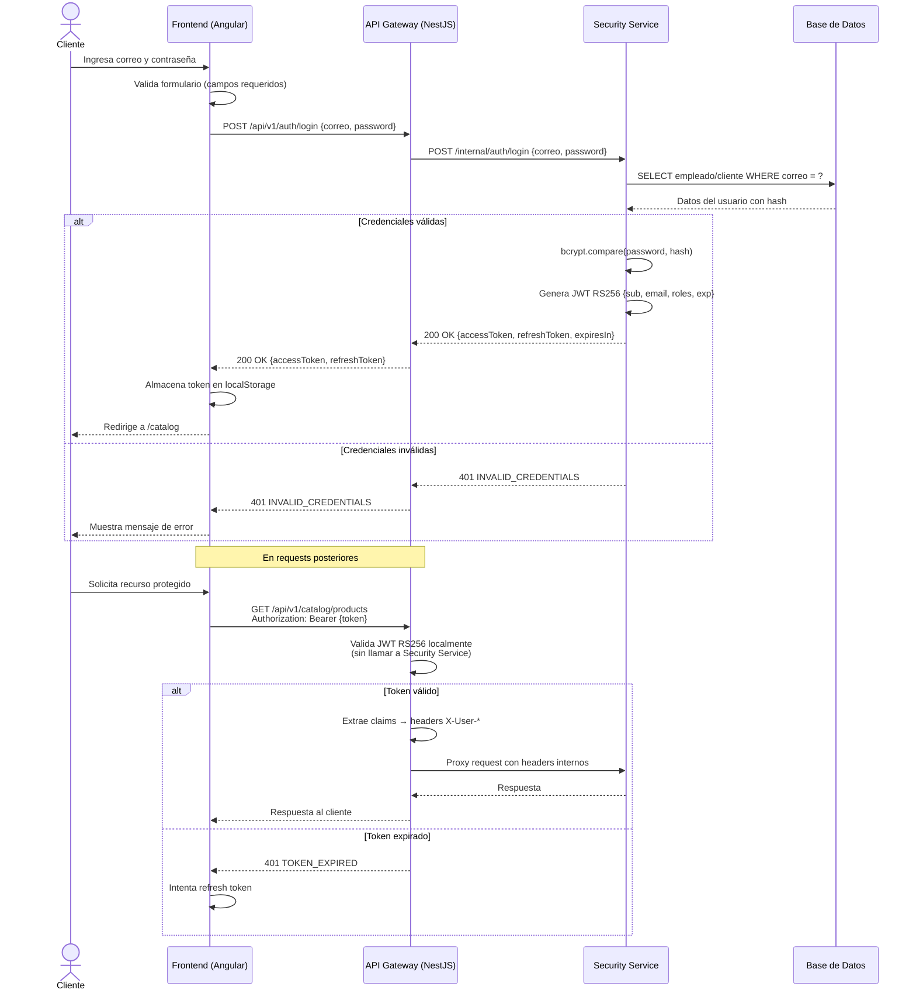

---

### DS-02: Flujo de Agregar Producto al Carrito y Crear Orden

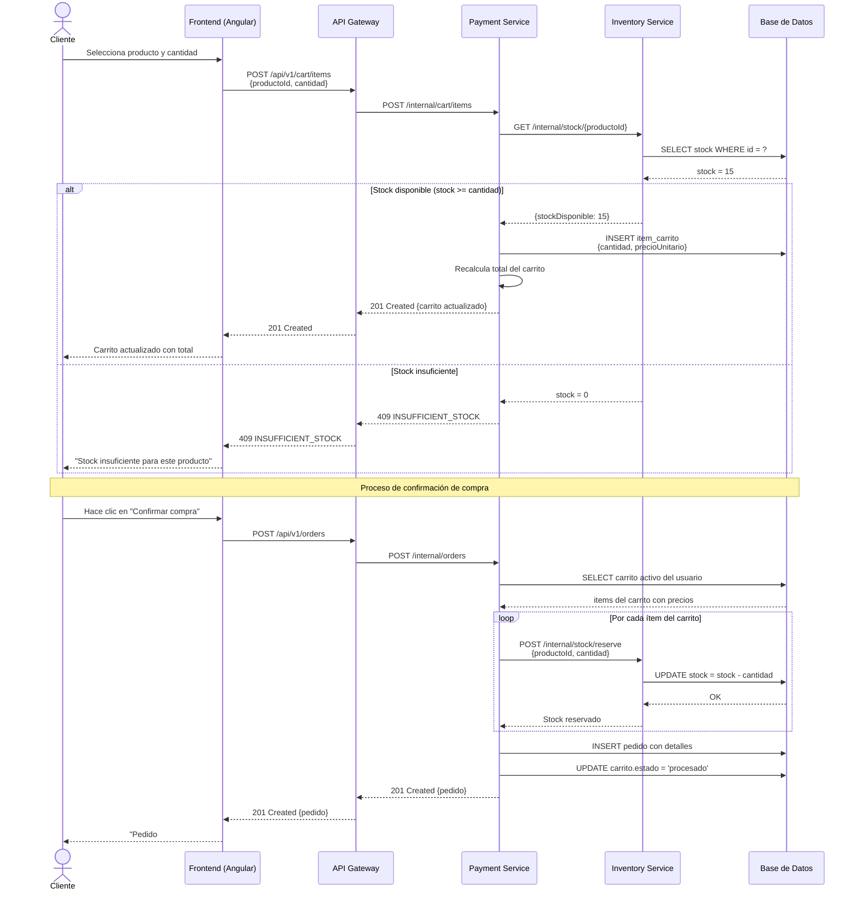

---

### DS-03: Flujo de Gestión de Producto por Administrador

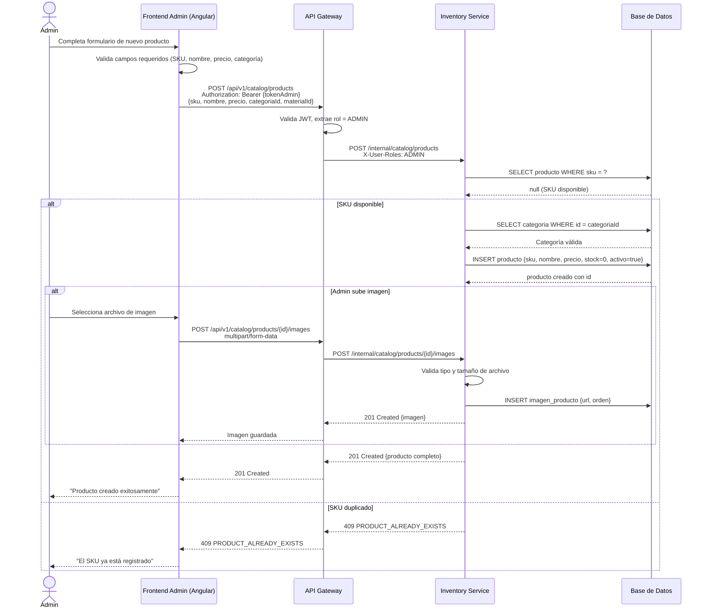

---

## 4. Diagrama de Estados

### Estados del Pedido

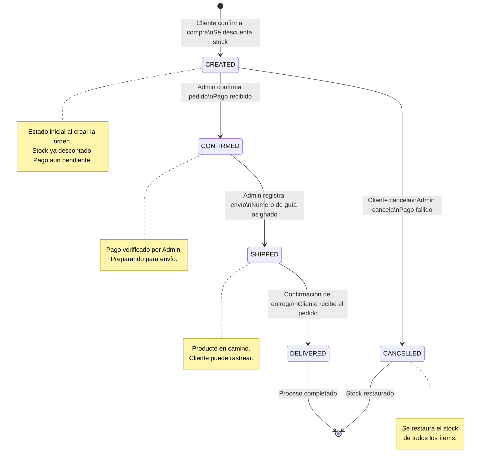

### Estados del Carrito

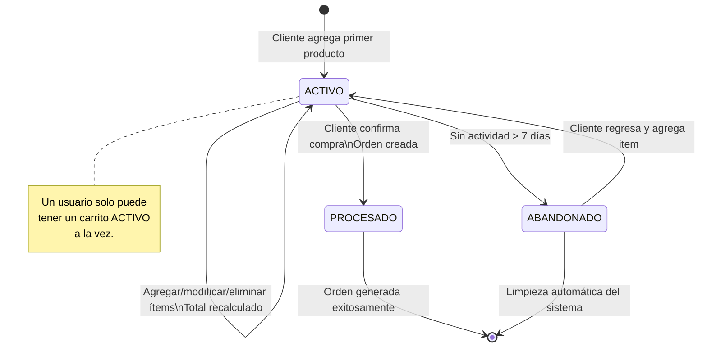

### Estados del Pago

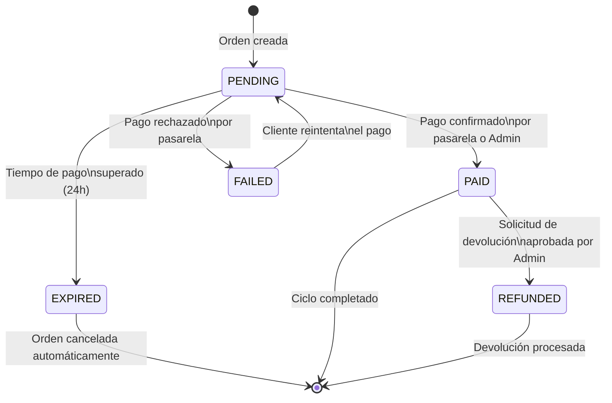

---

## 5. Decisiones de Diseño Documentadas

| Decisión                                     | Alternativas Consideradas       | Justificación                                                                                                      |
| -------------------------------------------- | ------------------------------- | ------------------------------------------------------------------------------------------------------------------ |
| **JWT RS256 con clave pública en Gateway**   | JWT HS256, sesiones en servidor | RS256 permite validación local sin llamar al Security Service, reduciendo latencia y punto de fallo.               |
| **Arquitectura de microservicios**           | Monolito, arquitectura modular  | Permite escalar servicios independientemente; el equipo puede trabajar en paralelo por módulo.                     |
| **Soft delete** para productos               | Hard delete                     | Preserva integridad referencial con órdenes históricas; permite recuperar productos desactivados.                  |
| **Captura de precio al agregar al carrito**  | Precio dinámico en tiempo real  | Evita que cambios de precio durante la sesión alteren el total esperado por el cliente.                            |
| **Schema por bounded context en PostgreSQL** | Base de datos por servicio      | Simplifica el MVP manteniendo aislamiento lógico; facilita la migración futura a BD por servicio.                  |
| **Stack políglota (NestJS + Spring Boot)**   | Un solo lenguaje                | Aprovecha fortalezas de cada framework: NestJS para proxy/middleware, Spring Boot para lógica de negocio compleja. |
