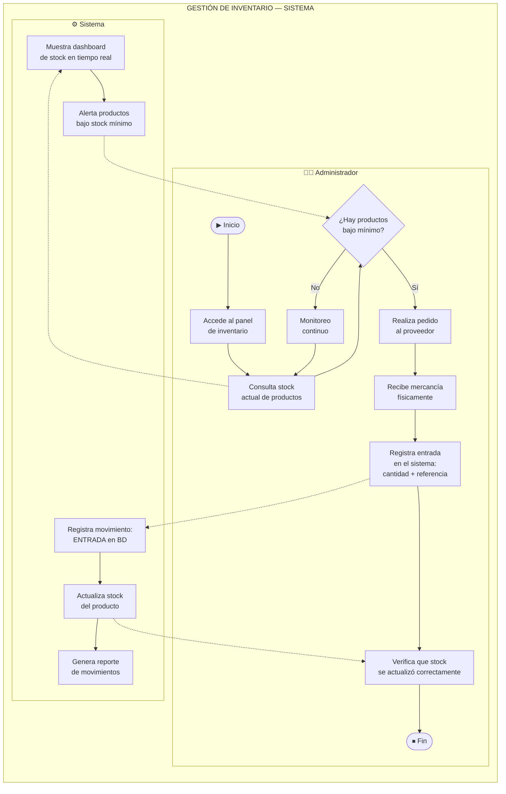

# Entregable 4 — Modelado de Procesos BPMN

**Proyecto:** Accesorios D&M — Sistema E-Commerce  
**Versión:** 1.0  
**Fecha:** 2026-05-18  
**Notación:** BPMN 2.0

---

## Introducción

Se modelan tres procesos de negocio independientes en formato BPMN TO-BE (con el nuevo sistema), precedidos cada uno por la descripción del proceso AS-IS (situación actual manual). Se identifican las actividades automatizadas por el sistema y las mejoras de eficiencia obtenidas.

---

## BPMN 1 — Proceso de Venta: De la Consulta a la Orden Confirmada

### AS-IS (Proceso Actual — Manual)

**Participantes:** Cliente · Propietaria

```
┌─────────────────────────────────────────────────────────────────────────────────┐
│ POOL: PROCESO DE VENTA ACTUAL (MANUAL)                                          │
├──────────────────────────┬──────────────────────────────────────────────────────┤
│   LANE: Cliente          │   LANE: Propietaria                                  │
│                          │                                                      │
│  (Inicio)                │                                                      │
│     │                    │                                                      │
│     ▼                    │                                                      │
│  [Busca productos en  ]──┼──► [Responde con fotos y precios via DM/WhatsApp]    │
│  [Instagram/WhatsApp  ]  │             │                                        │
│     │                    │             ▼                                        │
│     ▼                    │    ¿Tiene el producto disponible?                    │
│  [Selecciona producto ]  │       │ NO → [Informa al cliente: sin stock]──►Fin   │
│  [y pregunta por él   ]  │       │ SI                                           │
│     │                    │             ▼                                        │
│     ▼                    │    [Negocia precio/envío por chat]                   │
│  [Confirma compra por ]◄─┼───  [Envía número de cuenta bancaria]                │
│  [WhatsApp            ]  │             │                                        │
│     │                    │             │                                        │
│     ▼                    │             ▼                                        │
│  [Realiza transferencia] │    [Espera comprobante de pago]                      │
│  [y envía comprobante ]──┼──► [Verifica pago en app del banco]                  │
│     │                    │             │                                        │
│                          │             ▼                                        │
│                          │    ¿Pago verificado?                                 │
│                          │       │ NO → [Solicita nuevo comprobante]            │
│                          │       │ SI                                           │
│                          │             ▼                                        │
│                          │    [Anota pedido en cuaderno/Excel]                  │
│                          │             │                                        │
│                          │             ▼                                        │
│                          │    [Prepara el paquete manualmente]                  │
│                          │             │                                        │
│                          │             ▼                                        │
│     [Recibe producto]◄───┼─── [Envía por domiciliario y notifica por WhatsApp]  │
│     │                    │                                                      │
│   (Fin)                  │                                                      │
└──────────────────────────┴──────────────────────────────────────────────────────┘
```

**Problemas del AS-IS:**

- Tiempo promedio de una venta: 2–4 horas (negociación + verificación de pago + anotación).
- Sin trazabilidad: los pedidos se pierden entre chats.
- Sin control de stock: se puede vender un producto ya agotado.
- Dependencia total de una persona: si la propietaria no está disponible, no hay ventas.
- Sin historial de clientes ni análisis de ventas.

---

### TO-BE (Proceso con el Nuevo Sistema)

```mermaid
flowchart TB
    subgraph POOL["PROCESO DE VENTA — SISTEMA ACCESORIOS D&M"]
        subgraph LANE_CLIENTE["🧑 Lane: Cliente"]
            E1([▶ Inicio]) --> A1[Accede al sitio web\naccesorios-dm.com]
            A1 --> A2{¿Tiene cuenta?}
            A2 -->|No| A3[Completa formulario\nde registro]
            A3 --> A4[Verifica correo y\ncrea cuenta]
            A2 -->|Sí| A5[Inicia sesión\ncorreo + contraseña]
            A4 --> A5
            A5 --> A6[Navega catálogo\ny aplica filtros]
            A6 --> A7[Selecciona producto\ny cantidad]
            A7 --> A8[Agrega al carrito]
            A8 --> A9{¿Continúa\ncomprando?}
            A9 -->|Sí| A6
            A9 -->|No| A10[Revisa carrito\ny totales]
            A10 --> A11[Ingresa dirección\nde envío]
            A11 --> A12[Selecciona\nmétodo de pago]
            A12 --> A13[Confirma compra\n→ Orden creada]
            A13 --> A14[Recibe confirmación\npor pantalla y email]
            A14 --> A15[Consulta estado\nde la orden en Mi cuenta]
            A15 --> E2([⏹ Fin])
        end

        subgraph LANE_SISTEMA["⚙️ Lane: Sistema"]
            SA1[Valida datos de\nregistro y crea cuenta]
            SA2[Autentica y genera\ntoken JWT RS256]
            SA3[Devuelve catálogo\npaginado desde BD]
            SA4[Valida stock en\ntiempo real]
            SA5{¿Stock\ndisponible?}
            SA6[Agrega ítem al carrito\nCaptura precio actual]
            SA7[Calcula total del carrito\nautomáticamente]
            SA8[Genera orden de compra\nDescuenta stock]
            SA9[Registra pago PENDING\nEnvía email de confirmación]
        end

        subgraph LANE_ADMIN["👩‍💼 Lane: Administrador"]
            AD1[Recibe notificación\nde nueva orden]
            AD2{¿Pago\nverificado?}
            AD3[Actualiza estado:\nCONFIRMED + PAID]
            AD4[Prepara el paquete]
            AD5[Registra envío:\nestado SHIPPED + guía]
            AD6[Sistema notifica\nal cliente]
        end

        %% Conexiones entre lanes
        A3 -.-> SA1
        A5 -.-> SA2
        A6 -.-> SA3
        A8 -.-> SA4
        SA4 --> SA5
        SA5 -->|Sí| SA6
        SA5 -->|No| ERR1[/Notifica: Stock\nInsuficiente/]
        ERR1 -.-> A7
        SA6 --> SA7
        SA7 -.-> A10
        A13 -.-> SA8
        SA8 --> SA9
        SA9 -.-> A14
        SA9 -.-> AD1
        AD1 --> AD2
        AD2 -->|Sí| AD3
        AD2 -->|No| AD7[Contacta al cliente\ny solicita pago]
        AD3 --> AD4
        AD4 --> AD5
        AD5 --> AD6
        AD6 -.-> A15
    end
```



**Actividades automatizadas por el sistema:**

| Actividad Manual (AS-IS)                  | Actividad Automatizada (TO-BE)              | Mejora                                             |
| ----------------------------------------- | ------------------------------------------- | -------------------------------------------------- |
| Responder consultas de productos por chat | Catálogo siempre disponible online          | Disponibilidad 24/7                                |
| Verificar stock manualmente               | Validación automática al agregar al carrito | Elimina ventas sin stock                           |
| Calcular total y comunicar por chat       | Cálculo automático del carrito              | Elimina errores de cálculo                         |
| Anotar pedido en cuaderno/Excel           | Creación automática de orden en BD          | Trazabilidad total                                 |
| Verificar comprobante de pago manual      | Integración con pasarela de pago            | Reduce tiempo de verificación de 30 min a segundos |
| Notificar estado por WhatsApp             | Notificación automática por email y portal  | Consistencia en comunicación                       |
| Reportes de ventas manual                 | Reportes generados desde la BD              | Datos siempre actualizados                         |

---

## BPMN 2 — Proceso de Gestión de Inventario

### AS-IS (Proceso Actual)

```
┌──────────────────────────────────────────────────────────────────────────┐
│ INVENTARIO ACTUAL (MANUAL)                                               │
├──────────────────────────────┬───────────────────────────────────────────┤
│ LANE: Propietaria            │ LANE: Proveedor                           │
│                              │                                           │
│ (Inicio)                     │                                           │
│    │                         │                                           │
│    ▼                         │                                           │
│ [Detecta que falta stock]    │                                           │
│ [revisando físicamente]      │                                           │
│    │                         │                                           │
│    ▼                         │                                           │
│ [Anota en Excel cuánto]      │                                           │
│ [hay de cada producto]       │                                           │
│    │                         │                                           │
│    ▼                         │                                           │
│ [Contacta proveedor]────────►│[Cotiza y envía productos]                 │
│ [por WhatsApp]               │         │                                 │
│    │                         │         │                                 │
│    ◄─────────────────────────┼─────────┘                                 │
│    ▼                         │                                           │
│ [Recibe mercancía y]         │                                           │
│ [cuenta manualmente]         │                                           │
│    │                         │                                           │
│    ▼                         │                                           │
│ [Actualiza Excel de]         │                                           │
│ [inventario manualmente]     │                                           │
│    │                         │                                           │
│  (Fin)                       │                                           │
└──────────────────────────────┴───────────────────────────────────────────┘
```

### TO-BE (Con el Sistema)



**Mejoras del TO-BE vs AS-IS:**

- Stock actualizado en tiempo real (antes: Excel desactualizado).
- Historial completo de movimientos (antes: no había trazabilidad).
- Alertas automáticas de stock bajo (antes: detección manual y tardía).
- Reportes automáticos por período (antes: consolidación manual).

---

## BPMN 3 — Proceso de Autenticación y Acceso Seguro

### AS-IS (Proceso Actual)

```
Sin sistema de autenticación. Cualquier persona con acceso a Instagram
puede interactuar con la tienda. No existe diferenciación de roles.
El acceso a información de pedidos es vía WhatsApp personal.
```

### TO-BE (Con el Sistema)

```mermaid
flowchart TB
    subgraph POOL3["AUTENTICACIÓN Y CONTROL DE ACCESO"]
        subgraph L_USUARIO["👤 Usuario (Cliente/Admin)"]
            C1([▶ Inicio]) --> C2[Accede a\naccesorios-dm.com]
            C2 --> C3{¿Tiene\ncuenta?}
            C3 -->|No| C4[Completa formulario\nde registro]
            C4 --> C5[Envía datos al sistema]
            C3 -->|Sí| C6[Ingresa correo\ny contraseña]
            C6 --> C7[Envía credenciales\nal sistema]
        end

        subgraph L_GATEWAY["🔐 API Gateway"]
            GW1[Recibe solicitud de\nlogin/registro]
            GW2[Reenvía al\nSecurity Service]
            GW3[Recibe JWT RS256]
            GW4[En cada request:\nvalida JWT localmente]
            GW5{¿Token\nválido?}
            GW6[Extrae claims:\nsub, email, roles]
            GW7[Agrega headers:\nX-User-Id, X-User-Roles]
            GW8[Reenvía al\nservicio destino]
        end

        subgraph L_SECURITY["🛡️ Security Service"]
            SS1[Valida datos de\nregistro]
            SS2{¿Correo\nregistrado?}
            SS3[Crea cuenta con\nbcrypt hash]
            SS4[Verifica credenciales]
            SS5{¿Contraseña\ncorrecta?}
            SS6[Genera JWT RS256\n{sub, email, roles, exp:1h}]
            SS7[Retorna accessToken\ny refreshToken]
        end

        subgraph L_RECURSO["📦 Servicio de Negocio"]
            RS1[Recibe request con\nheaders de usuario]
            RS2{¿Rol autorizado\npara este endpoint?}
            RS3[Procesa solicitud\nnormalmente]
            RS4[/403 FORBIDDEN/]
        end

        %% Flujo registro
        C5 -.-> GW1
        GW1 --> GW2
        GW2 --> SS1
        SS1 --> SS2
        SS2 -->|Sí| ERR2[/409 USER_ALREADY_EXISTS/]
        SS2 -->|No| SS3
        SS3 -.-> C2

        %% Flujo login
        C7 -.-> GW1
        GW1 --> GW2
        GW2 --> SS4
        SS4 --> SS5
        SS5 -->|No| ERR3[/401 INVALID_CREDENTIALS/]
        SS5 -->|Sí| SS6
        SS6 --> SS7
        SS7 -.-> GW3
        GW3 -.-> C2

        %% Flujo validación en cada request
        GW3 --> GW4
        GW4 --> GW5
        GW5 -->|No| ERR4[/401 UNAUTHORIZED o TOKEN_EXPIRED/]
        GW5 -->|Sí| GW6
        GW6 --> GW7
        GW7 --> GW8
        GW8 --> RS1
        RS1 --> RS2
        RS2 -->|No| RS4
        RS2 -->|Sí| RS3
        RS3 --> E4([⏹ Fin])
    end
```

**Identificación de automatización:**

| Proceso                    | AS-IS             | TO-BE                           | Automatización                                |
| -------------------------- | ----------------- | ------------------------------- | --------------------------------------------- |
| Identificación del usuario | Sin autenticación | JWT RS256                       | Sistema genera y valida token automáticamente |
| Control de acceso          | Sin restricciones | Roles ADMIN/CLIENTE             | Gateway aplica guards automáticamente         |
| Gestión de contraseñas     | Sin sistema       | bcrypt hash                     | Sistema encripta automáticamente al registrar |
| Sesión del usuario         | Sin sesión        | Token con expiración de 1h      | Renovación automática con refresh token       |
| Auditoría de accesos       | Sin registros     | Log de cada request con traceId | Sistema registra automáticamente en logs      |

---

## Resumen de Mejoras de Eficiencia

| Indicador                               | AS-IS (Manual)                | TO-BE (Sistema)                 | Mejora Estimada   |
| --------------------------------------- | ----------------------------- | ------------------------------- | ----------------- |
| Tiempo promedio de una venta            | 2–4 horas                     | 5–10 minutos                    | **−95%**          |
| Disponibilidad del catálogo             | 8–22h (horario de atención)   | 24/7                            | **+300%**         |
| Errores de stock (venta sin inventario) | ~15% de ventas                | 0% (validación automática)      | **−100%**         |
| Tiempo de verificación de pago          | 15–30 minutos                 | Instantáneo (pasarela)          | **−98%**          |
| Trazabilidad de pedidos                 | Cuaderno manual / WhatsApp    | BD estructurada                 | **Total**         |
| Capacidad de pedidos simultáneos        | 1 (una conversación a la vez) | Ilimitada (sistema concurrente) | **∞**             |
| Gestión de inventario                   | Revisión manual diaria        | Tiempo real automático          | **−90% esfuerzo** |
